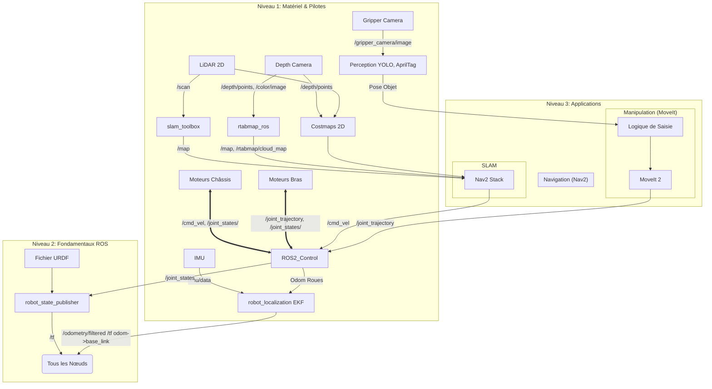

## Pilote et structure

### URDF/XACRO

### publication des transformations

### pilote du materiel

lidar2D
depth camera
camera pince
IMU

### Contrôle
ros2_control avec Hardware interface

controller_manager
mecanum_drive_controller

### Odométrie

## SLAM

### Cartographie 2D
    slam_toolbox

### Cartographie 3D

## Navigation

## manipulation

