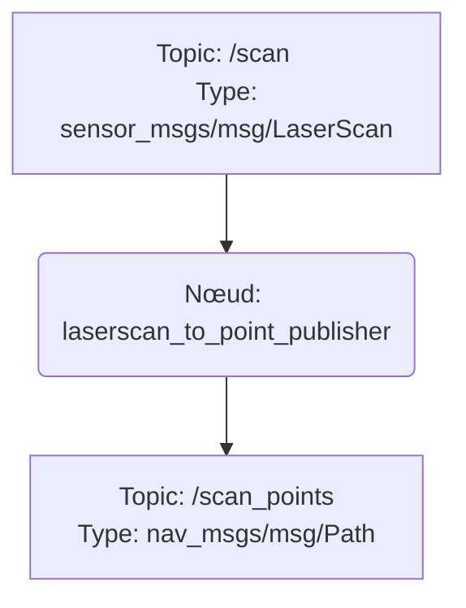

# laserscan_to_point_pulisher

## Description

Ce paquet ROS2 fournit un nœud qui convertit les données d'un balayage laser (`sensor_msgs/msg/LaserScan`) en un nuage de points représenté par un chemin (`nav_msgs/msg/Path`). Il est utile pour visualiser les données du laser sous forme de points dans des outils comme RViz2 ou pour d'autres nœuds qui nécessitent une représentation des obstacles sous forme de points cartésiens.

## Fonctionnement

Le nœud principal, `laserscan_to_point_publish`, s'abonne au topic `/scan`. À chaque réception d'un message `LaserScan`, il parcourt chaque mesure de distance et la convertit de coordonnées polaires (distance et angle) en coordonnées cartésiennes (x, y). Chaque point (x, y) est ensuite encapsulé dans un message `PoseStamped` et ajouté à un message `Path`. Ce message `Path` est finalement publié sur le topic `/scan_points`.

### Diagramme de flux (Mermaid)

## Entrées attendues

-   **Topic :** `/scan`
-   **Type de message :** `sensor_msgs/msg/LaserScan`
-   **Description :** Données brutes provenant d'un capteur Lidar.

## Sorties générées

-   **Topic :** `/scan_points`
-   **Type de message :** `nav_msgs/msg/Path`
-   **Description :** Une séquence de messages `PoseStamped` où chaque pose représente un point du balayage laser dans un repère cartésien 2D.

## Fichiers de configuration

Ce nœud n'a pas de fichiers de configuration externes. Les noms des topics sont codés en dur dans le script Python.

## Configuration requise

Aucune configuration spécifique n'est nécessaire pour ce nœud. Cependant, il est impératif qu'un autre nœud (par exemple, le pilote d'un Lidar) publie des messages `LaserScan` sur le topic `/scan` pour que ce nœud puisse fonctionner correctement.
