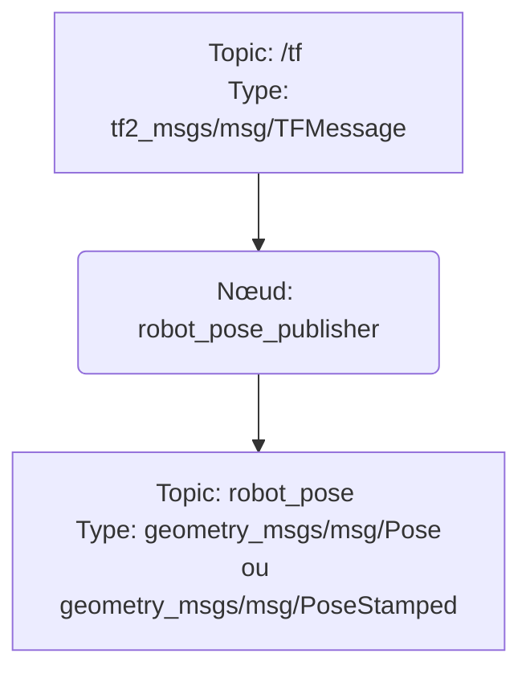

# robot_pose_publisher_ros2

## Description

Ce paquet ROS2 fournit un nœud qui publie la pose (position et orientation) d'un robot en tant que message `geometry_msgs/msg/Pose` ou `geometry_msgs/msg/PoseStamped`. Le nœud détermine la pose du robot en recherchant la transformation (TF) entre deux repères de coordonnées spécifiés, généralement le repère de la carte (`map`) et le repère de base du robot (`base_link`).

## Fonctionnement

Le nœud `robot_pose_publisher` utilise un `tf2_ros::TransformListener` pour écouter en continu les transformations publiées sur le topic `/tf`. À intervalle régulier (toutes les 50 millisecondes), il tente de récupérer la transformation entre les repères `map_frame` et `base_frame`. Si la transformation est trouvée, il la convertit en un message de pose et la publie sur le topic `robot_pose`.

### Diagramme de flux (Mermaid)

## Entrées attendues

-   **Topic :** `/tf`
-   **Type de message :** `tf2_msgs/msg/TFMessage`
-   **Description :** Arbre de transformations du robot. Il est essentiel qu'une transformation entre les repères spécifiés (`map_frame` et `base_frame`) soit disponible. Cette transformation est généralement publiée par un nœud de localisation comme AMCL ou un simulateur comme Gazebo.

## Sorties générées

-   **Topic :** `/robot_pose`
-   **Type de message :** `geometry_msgs/msg/Pose` ou `geometry_msgs/msg/PoseStamped` (configurable)
-   **Description :** La pose 3D du robot dans le repère de la carte.

## Fichiers de configuration

Ce nœud est configurable via des paramètres ROS2. Les paramètres peuvent être définis dans un fichier de lancement (`.launch.py`) ou passés en ligne de commande.

-   **`map_frame`** (string, default: "map"): Le nom du repère de référence (généralement la carte).
-   **`base_frame`** (string, default: "base_link"): Le nom du repère attaché au robot.
-   **`is_stamped`** (bool, default: false): Si `true`, le message de sortie sera de type `PoseStamped`, incluant un en-tête avec l'horodatage et le `frame_id`. Si `false`, ce sera un message `Pose`.

## Configuration requise

Pour que ce nœud fonctionne correctement, les conditions suivantes doivent être remplies :

1.  Un arbre de transformations TF doit être publié, et il doit contenir un chemin de transformation valide entre `map_frame` et `base_frame`.
2.  Les noms des repères (`map_frame` et `base_frame`) doivent correspondre à ceux utilisés dans votre système robotique. Vous pouvez les reconfigurer via les paramètres ROS2.
