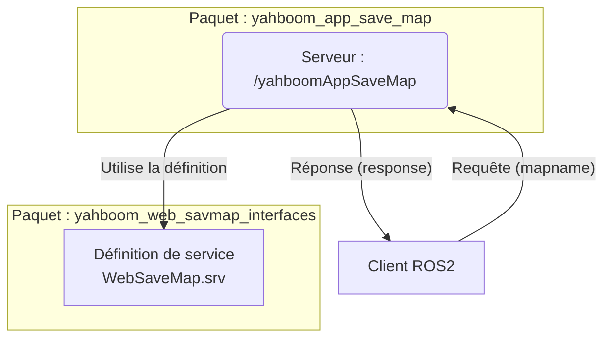

# yahboom_web_savmap_interfaces

## Description

Ce paquet ROS2 contient les définitions d'interfaces (messages, services) utilisées pour la communication entre une application web et le robot Yahboom. L'objectif est de fournir des structures de données standardisées pour les interactions à distance.

Ce paquet définit actuellement une interface de service pour la sauvegarde de cartes.

## Interfaces définies

### Service `WebSaveMap.srv`

Ce service est utilisé pour demander la sauvegarde de la carte de navigation actuelle du robot.

-   **Requête :**
    -   `string mapname` : Le nom à donner à la carte qui sera sauvegardée.
-   **Réponse :**
    -   `string response` : Une chaîne de caractères de confirmation ou d'erreur.

### Diagramme de flux (Mermaid)

## Utilisation

Ce paquet n'est pas destiné à être exécuté directement. Il doit être inclus comme une dépendance dans d'autres paquets ROS2 qui ont besoin d'utiliser les interfaces qu'il définit.

Par exemple, le paquet `yahboom_app_save_map` utilise le service `WebSaveMap` pour exposer sa fonctionnalité de sauvegarde de carte.

## Compilation

Comme pour tout paquet ROS2, il doit être compilé avec `colcon build` dans l'espace de travail. Le processus de compilation générera le code C++ et Python nécessaire pour que d'autres nœuds puissent utiliser ces interfaces.
