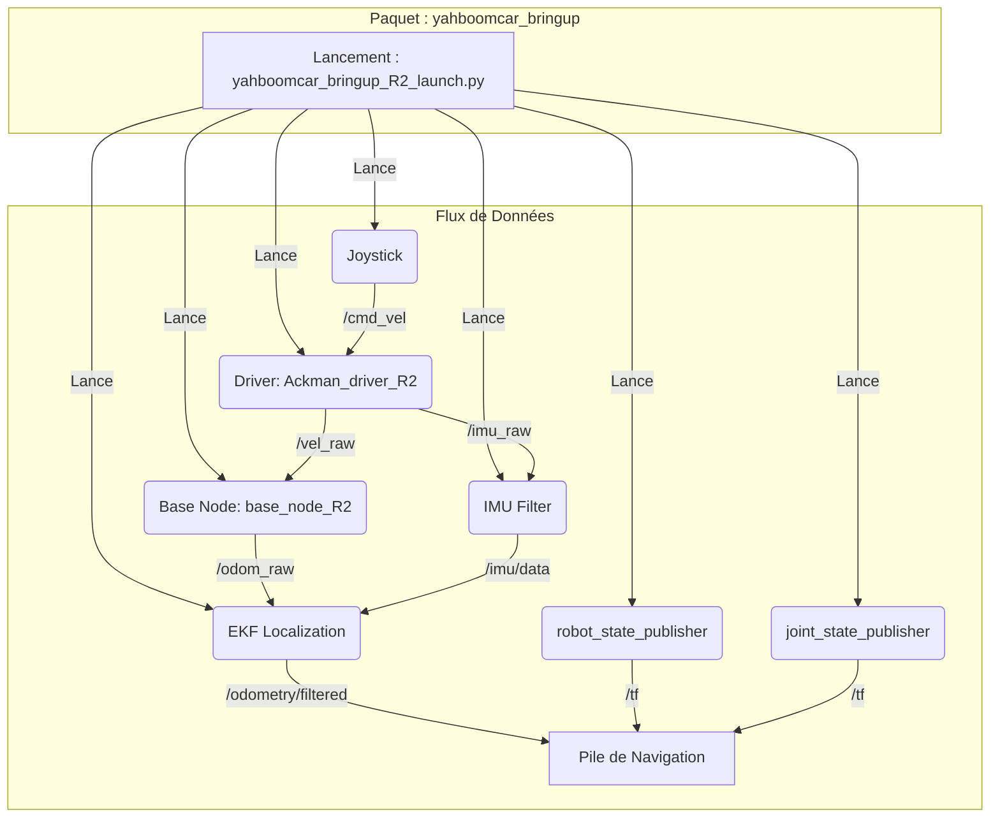

# yahboomcar_bringup

## Description

Ce paquet ROS2 est le point d'entrée principal pour lancer le robot Yahboom. Il contient les fichiers de lancement (`.launch.py`) qui orchestrent le démarrage de tous les nœuds nécessaires au fonctionnement de base du robot.

Le mot "bringup" dans l'écosystème ROS fait référence au processus d'activation et d'initialisation du matériel et des pilotes logiciels de base d'un robot.

## Fonctionnement

Ce paquet ne contient pas de code de nœud exécutable directement. Sa fonction principale est de fournir des scripts de lancement qui effectuent les actions suivantes :

1.  **Chargement du modèle du robot** : Il charge le fichier URDF (Unified Robot Description Format) du robot (depuis `yahboomcar_description`) et le publie via le nœud `robot_state_publisher`. Ce nœud publie les transformations (TF) des différentes parties statiques du robot (par exemple, la relation entre la base, les roues, le support de la caméra, etc.).
2.  **Publication des états des articulations** : Il lance un nœud `joint_state_publisher` qui publie l'état des articulations mobiles du robot (par exemple, la rotation des roues).
3.  **Lancement des pilotes de bas niveau** : Il démarre le nœud "driver" (par exemple, `Ackman_driver_R2`) qui communique directement avec le matériel du robot (la carte microcontrôleur) pour envoyer des commandes de vitesse et recevoir des données brutes comme les ticks d'encodeurs et les données IMU.
4.  **Lancement du nœud de base** : Il exécute le nœud de base correspondant au robot (par exemple, `base_node_R2` de `yahboomcar_base_node`) qui calcule l'odométrie à partir des données de vitesse brutes.
5.  **Filtrage et fusion de capteurs** :
    *   Il lance un nœ-ud de filtrage d'IMU (`imu_filter_madgwick`) pour traiter les données brutes de l'unité de mesure inertielle.
    *   Il lance un nœud d'estimation de pose (`robot_localization` avec EKF - Extended Kalman Filter) pour fusionner les données de l'odométrie des roues et de l'IMU, fournissant ainsi une estimation de la pose plus robuste.
6.  **Lancement des outils de contrôle et de visualisation** :
    *   Il peut démarrer des nœuds pour le contrôle par joystick (`joy` et `yahboom_joy_R2`).
    *   Il peut lancer RViz2 avec une configuration prédéfinie pour visualiser le modèle du robot et les données des capteurs.

### Diagramme de flux (Exemple pour R2)



## Utilisation

Pour lancer le robot, vous exécutez le fichier de lancement correspondant à votre modèle de robot. Par exemple, pour le robot R2 :
```bash
ros2 launch yahboomcar_bringup yahboomcar_bringup_R2_launch.py
```

## Fichiers de configuration

-   **`launch/`** : Contient les principaux fichiers de lancement pour chaque type de robot.
-   **`param/`** : Contient des fichiers de configuration YAML, par exemple pour le filtre IMU ou le nœud EKF.
-   **`rviz/`** : Contient des fichiers de configuration pour RViz2.

## Dépendances

Ce paquet a de nombreuses dépendances, car il est le point central de l'architecture logicielle du robot. Il dépend notamment de :
-   `yahboomcar_description` (pour le modèle URDF)
-   `yahboomcar_base_node` (pour l'odométrie)
-   `robot_localization` (pour la fusion de capteurs)
-   `imu_filter_madgwick` (pour le filtrage IMU)
-   `joy` et `yahboomcar_ctrl` (pour le contrôle par joystick)
-   `robot_state_publisher` et `joint_state_publisher`
