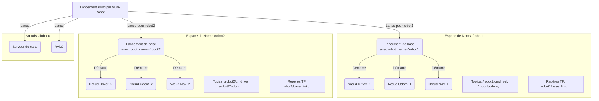

# yahboomcar_multi

## Description

Ce paquet ROS2 est spécifiquement conçu pour gérer des scénarios **multi-robots**. Il contient les configurations et les fichiers de lancement nécessaires pour démarrer, contrôler et faire naviguer plusieurs robots Yahboom simultanément dans un même environnement.

L'objectif principal est de s'assurer que les robots peuvent coexister sans interférence, en isolant leurs systèmes de communication respectifs.

## Fonctionnement

La stratégie centrale utilisée dans ce paquet pour gérer plusieurs robots est l'utilisation des **espaces de noms (namespaces) ROS**.

### 1. Isolation par Espace de Noms

-   Chaque robot se voit attribuer un nom unique (par exemple, `robot1`, `robot2`).
-   Les fichiers de lancement de ce paquet (comme `R2_bringup_multi.launch.xml`) utilisent cet identifiant pour placer tous les nœuds d'un robot donné dans un espace de noms correspondant (par exemple, `/robot1`).
-   Cela a pour effet de préfixer tous les noms de topics, services et repères TF de ce robot. Par exemple, pour `robot1` :
    -   Le topic `/cmd_vel` devient `/robot1/cmd_vel`.
    -   Le topic `/odom` devient `/robot1/odom`.
    -   Le repère TF `base_link` devient `robot1/base_link`.
-   Cette isolation empêche les robots de recevoir les commandes ou les données des capteurs des autres, leur permettant de fonctionner de manière indépendante.

### 2. Fichiers de Lancement

-   **Fichiers de base (par robot)** : Des fichiers comme `R2_bringup_multi.launch.xml` sont conçus pour lancer la pile logicielle d'un seul robot, mais de manière "paramétrable" via un argument `robot_name`.
-   **Fichiers de haut niveau** : D'autres fichiers de lancement (par exemple, `multi_queue_launch.py`) sont chargés d'exécuter les fichiers de base plusieurs fois, une fois pour chaque robot, en leur passant un `robot_name` différent à chaque fois.
-   **Navigation multi-robot** : Le paquet inclut également des fichiers pour lancer la pile de navigation (AMCL, planificateur de trajectoire, etc.) pour chaque robot individuellement, en utilisant des cartes et des configurations partagées ou spécifiques.

### Diagramme de flux (Conceptuel)

## Contenu

-   **`launch/`** : Le cœur du paquet. Contient une collection de fichiers de lancement (`.py` et `.xml`) pour diverses configurations multi-robots.
-   **`maps/`** : Cartes de navigation (`.yaml`, `.pgm`) destinées à être utilisées dans des scénarios multi-robots.
-   **`param/`** : Fichiers de configuration (`.yaml`) pour les différents nœuds (comme `robot_localization`), souvent avec des versions spécifiques à chaque robot (par exemple, `R2_ekf_robot1.yaml`).

## Utilisation

Pour lancer une simulation ou un déploiement multi-robot, vous devez exécuter l'un des fichiers de lancement de haut niveau. La commande exacte dépendra du scénario spécifique que vous souhaitez exécuter (par exemple, deux robots R2 naviguant dans la même carte).

Ce paquet est essentiel pour la recherche et le développement sur la coordination de flottes de robots, la navigation multi-agents et les systèmes décentralisés.
